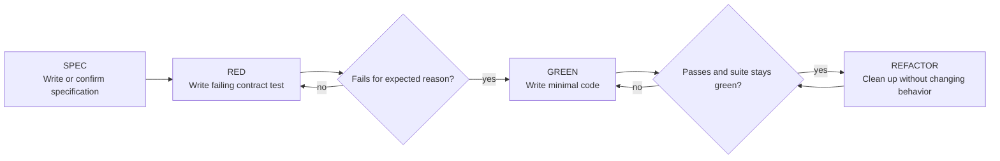

# Specification-Driven TDD

Write the specification first. Write the test from the specification. Watch it fail. Then write the minimum code to pass.

**Core principle:** tests verify the contract only. They do not verify algorithms, helper calls, private state, or other implementation details.

## When to Use

Use for:
- New features
- Bug fixes
- Behavior changes
- Rewrites of untested code

Ask your human partner before skipping this workflow for:
- Throwaway prototypes
- Generated code
- Pure configuration changes

## The Iron Laws

```text
NO PRODUCTION CODE WITHOUT A FAILING CONTRACT TEST FIRST
NO CONTRACT TEST WITHOUT A SPECIFICATION FIRST
```

If code exists before a failing contract test:
1. Extract or write the specification first
2. Delete the implementation
3. Restart from the specification and tests

Do not keep old code as "reference". Once the specification exists, implement fresh from the contract.

## Workflow



## Step 0: Establish the Specification

Before writing tests, ensure there is an implementation-independent specification.

### If a specification already exists

Use it as the source of truth. Do not widen the contract silently while testing.

### If code exists but no specification exists

Write a specification for the function/class/module before testing it.

Rules:
- The specification must follow the `writing-specifications` skill
- The specification must describe only observable behavior
- The specification must not mention algorithms, helper methods, private fields, data structures, query shape, call ordering, or other implementation details
- If the existing code suggests multiple plausible contracts, ask the human which one is intended

After the specification is written, delete the untested implementation and restart from the spec.

### If neither code nor specification exists

Invoke `writing-specifications`.

If you know the intended behavior well enough, write the specification.

If you do not know the intended behavior well enough to write a precise contract, ask the human. Do not guess at business rules.

## What Tests May Assert

Tests may assert only behavior that the specification promises:
- Accepted inputs
- Returned outputs
- Documented exceptions or error results
- Documented mutations
- Documented side effects

Tests must not assert behavior the specification does not promise:
- Internal helper calls
- Number of method calls unless contractually observable
- Traversal order unless specified
- Specific algorithm choice
- Specific data structure choice
- Private fields or internal state transitions
- Mock choreography standing in for real behavior

If a test needs one of these details to pass, either:
1. The test is wrong and should be rewritten, or
2. The specification is incomplete and must be updated first

## Red-Green-Refactor

### SPEC - Write the Contract

Write or refine the specification using `writing-specifications`.

Good specifications:
- Define behavior for all representable inputs
- Are precise enough to implement from
- Are precise enough to test from
- Stay declarative rather than operational

Bad specifications:
- Describe how the code works internally
- Mirror the current implementation
- Leave edge cases undefined

### RED - Write a Failing Contract Test

Write one minimal test derived directly from the specification.

<Good>
```typescript
test('returns the smallest matching index', () => {
  expect(findFirstIndex(['a', 'b', 'a'], 'a')).toBe(0);
});
```
This checks a promised observable result.
</Good>

<Bad>
```typescript
test('scans from left to right', () => {
  const spy = jest.spyOn(arrayHelpers, 'visit');
  findFirstIndex(['a', 'b', 'a'], 'a');
  expect(spy).toHaveBeenNthCalledWith(1, 'a');
});
```
This tests implementation strategy, not contract.
</Bad>

Requirements:
- One behavior per test
- Clear test name
- Assertion traces directly to the specification
- Real behavior over mocks whenever possible

### Verify RED - Watch It Fail

Run the targeted test.

```bash
npm test path/to/test.test.ts
```

Confirm:
- The test fails, not errors
- It fails for the expected contract reason
- It is not accidentally passing because the behavior already exists

If it passes immediately, you have not proven the test. Fix the test or delete prewritten implementation and restart.

### GREEN - Write Minimal Code

Write the smallest implementation that satisfies the failing contract test.

Allowed:
- Minimal code for the specified behavior
- Narrow refactors required to support the new code

Not allowed:
- Extra features not in the specification
- Internal instrumentation just to make tests easier
- New public behavior not covered by the spec and tests

### Verify GREEN - Watch It Pass

Run the targeted test again, then the relevant suite.

```bash
npm test path/to/test.test.ts
```

Confirm:
- The new test passes
- Existing relevant tests still pass
- Output is clean

If the test only passes because it was coupled to internals, rewrite the test to assert the contract instead.

### REFACTOR - Keep the Contract, Improve the Code

Refactor only after green.

Safe refactors:
- Remove duplication
- Improve names
- Extract helpers
- Simplify control flow

Refactoring must preserve:
- The specification
- The contract tests

If you need to change observable behavior, return to the specification first.

## Existing Untested Code

Untested code is not grandfathered in.

If implementation exists before tests:
1. Read the code only to understand possible intended behavior
2. Write an implementation-independent specification
3. Ask the human if intent is ambiguous
4. Delete the implementation
5. Rebuild with specification-driven TDD

Do not:
- Keep the old implementation around while writing tests
- Adapt tests to match the old code's incidental behavior
- Preserve internal APIs that exist only because the current code happens to use them

## Rationalizations to Reject

| Excuse | Reality |
|--------|---------|
| "The implementation already works" | Working code without a prior failing contract test is unproven. |
| "I'll write tests against what it does now" | That locks tests to implementation, not intent. |
| "I need spies to verify it works" | Usually you need better contract assertions, not deeper coupling. |
| "The spec can mention the current algorithm for clarity" | That is an implementation leak unless the algorithm itself is part of the contract. |
| "Deleting code is wasteful" | Keeping unverified code is technical debt with false confidence. |

## Red Flags - Stop and Restart

- Test written before specification
- Specification copied from implementation details
- Code written before a failing contract test
- Test passes immediately after being written
- Test asserts helper calls, private state, or incidental order not required by the contract
- Existing code is being used as reference during reimplementation after the delete step
- Mocks are replacing the actual behavior under test without necessity

## Verification Checklist

Before marking work complete:

- [ ] A specification exists for each new or changed contract
- [ ] The specification follows `writing-specifications`
- [ ] The specification contains no implementation details
- [ ] Every new behavior has a failing contract test first
- [ ] Each failing test failed for the expected reason
- [ ] Any prewritten implementation was deleted before reimplementation
- [ ] Tests assert only observable behavior promised by the specification
- [ ] All relevant tests pass
- [ ] Output is clean

## Final Rule

```text
Specification -> failing contract test -> production code
Otherwise -> not specification-driven TDD
```
